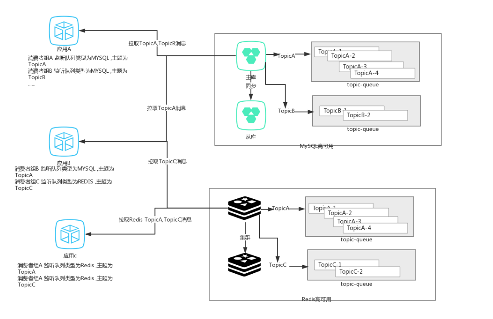

#  luoluo-delayMQ一个简单易用的java分布式延时队列组件

[github链接](https://github.com/lybbyl/delaymq)

[gitee链接](https://gitee.com/meiyougexingdewo/delaymq)

###  一. 系统介绍

1. 基于springboot开发
2. 基于现有轮子开发，可使用redis，mysql作为存储方式，后续迭代引入其他存储方式（es，mongo）。
3. 可同时使用redis，mysql作为存储件存储消息。
4. 依赖第三方进行存储，第三方配置成高可用则delayMQ为高可用！避免了每引入一个中间件就需要高可用部署的烦恼。
5. 易于扩展，支持服务划分。
6. 引入简单 ,一个jar包即可引入。快速开发。
7. 支持消息事务性，包含消息的发送与消费，支持事务一致。
8. 支持多种特性。

### 二. 问题引入

​	场景：下单之后如果三十分钟之内没有付款就自动取消订单， 大量未付款数据如何高效的取消订单。

​	解决：相对于市面上的消息队列，要实现延时都相对困难。rocketmq可以自定义延时level，其他队列可以依靠死性队列进行回补。

当引入各类消息队列时，还需要保障其高可用（成本高昂）。大部分web项目都具有完善的redis高可用或mysql部署，因此决定利用现成中间件进行开发延时队列。

### 三. 架构

 

### 四. 特性

1. 可同时支持多种存储方式的延时队列（redis，mysql）
2. 支持全事务的延时消息（队列存储方式为mysql），`发送消息` 和 `消息消费`都支持和`本地事务一致`。
4. 支持顺序消费消息
5. 提供两种管理消费者消费的模式：集中管理和各自管理
6. 基于分布式锁下的安全消费
7. 消费者基于注解的灵活配置，注解覆盖配置
7. 支持与业务
8. 简易API
9. topicManager的自动刷新

### 五. 简单入门

[简单示例](doc/Sample.md)

### 六. Questions

1. redis队列和mysql队列异同

> - redis 队列性能高，但是消息都具有存活时间，不能长时间保存。并且对于消息的生命周期分析相对不友好。业务需要并发性能并能接受小部分异常情况出现（redis宕机丢失一秒消息），则可使用redis队列。
> - mysql队列存储可靠，**当消息表和业务表在同一数据库时，可以保证分布式事务！**并且消息持久化，利于分析消息的整个生命周期。但性能不足，业务需要确保一致时，这是好的选择。
> - delaymq**可以同时**使用redis和mysql作为队列。因此上述可以互补，交由业务抉择。

2. 能否分离业务库和消息库（redis,mysql）

> - 通过spring多数据源的配置可以轻松分离业务科，和消息库。示例[简单示例](Sample.md)
> - 当使用mysql队列并分离了业务库和消息库时，发送消息需使用发送事务消息可保证发送一致性，但消费不一定（消费成功提交事务，突然宕机，会重试消息，此时业务端保证幂等即可）。
> - 分布式锁使用的redisson，也可自由配置数据源。

3. 消费者管理模式Merge和Part

> - 消费者管理模式 为统一管理merge 和 各自管理part
> - 统一管理由同一个线程池共同调度所有的消费线程，适用于一个服务具有多个consumer，但如果存在耗时长的消费者时，可能阻塞其他消费者。
> - 各自管理，每个消费者都有自身的线程池负责调度，缺点是多consumer时，但可能实例太多线程。(参考rocketMQ)
默认为统一管理.

4. 查看消息消费情况

> 记录消息id。
>
> msyql队列查看message_consumer_record表
>
> redis队列查看`MESSAGE:CONSUME:***`对应topic Map （注意：有过期时间）

5. 业务异常需要回滚已消费的

> 例如新发版的代码有bug，如果才能消费 已被消费过的消息。
>
> **严重不推荐**：宁愿清洗数据也不要这么做
> 利用reverseTime设置回退消费位点，删除对应的消费记录
>
> **不推荐，慎重，**

6. 事务消费

> 1：当使用mysql作为队列存储 
> 2：消息表和业务表同库 
> 3：支持jdbcTemplae和mybatis 不支持jpa(jpa不支持nested传播)
> 4：com.luoluo.delaymq.consumer.support-transaction=true

7. 动态扩容
> 每一个topic可以对应多个topic-queue用来降低消费间的争抢。
> 可以动态的新增topic-queue实现扩容队列和增大消费能力
>
> 如下是mysql队列的扩容过程
> ~~~sql
> CREATE TABLE `MESSAGE:QUEUE:Test:4` (
>   `id` varchar(64) NOT NULL COMMENT 'ID',
>   `version` int(10) unsigned DEFAULT '0' COMMENT '版本号',
>   `updated_time` datetime DEFAULT NULL COMMENT '更新时间',
>   `created_time` timestamp NOT NULL DEFAULT CURRENT_TIMESTAMP COMMENT '操作时间',
>   `score` bigint(13) DEFAULT NULL COMMENT '分数',
>   PRIMARY KEY (`id`),
>   KEY `index_score` (`score`)
> ) ENGINE=InnoDB DEFAULT CHARSET=utf8mb4 COMMENT='Message:QUEUE:Test:4顺序表';
> 
> CREATE TABLE `MESSAGE:QUEUE:Test:DELAY:4` (
>   `id` varchar(64) NOT NULL COMMENT 'ID',
>   `version` int(10) unsigned DEFAULT '0' COMMENT '版本号',
>   `updated_time` datetime DEFAULT NULL COMMENT '更新时间',
>   `created_time` timestamp NOT NULL DEFAULT CURRENT_TIMESTAMP COMMENT '操作时间',
>   `score` bigint(13) DEFAULT NULL COMMENT '分数',
>   PRIMARY KEY (`id`),
>   KEY `index_score` (`score`)
> ) ENGINE=InnoDB DEFAULT CHARSET=utf8mb4 COMMENT='Message:QUEUE:Test:DELAY:4顺序表';
> 
> update table `message_topic_table` set topic_data ='{"queueNames": ["Message:QUEUE:Test:0", "Message:QUEUE:Test:1", "Message:QUEUE:Test:2", "Message:QUEUE:Test:3","Message:QUEUE:Test:4"], "rebalanceStrategyEnum": "ROUND"}' where id ='Test';
> ~~~
>
> redis队列扩容
>
> ~~~
> set MESSAGE:TOPIC:TABLE:Test "{\"queueNames\": [\"Message:QUEUE:Test:0\", \"Message:QUEUE:Test:1\", \"Message:QUEUE:Test:2\", \"Message:QUEUE:Test:3\",\"Message:QUEUE:Test:4\"], \"rebalanceStrategyEnum\": \"ROUND\"}"
> ~~~

8. 消费消息追不上生产消息

> 如果消费消息的速度小于生产消息的速度
>
> 1. 优化消费接口（业务方优化），增大消费能力
> 2. 将不同业务的消息，拆分置不同库。不同库对应不同的redis库，降低加锁冲突。
> 3. 提pr，优化delaymq

9. 扩展

> 提前进行业务划分服务，服务连接不同库即可。

### 七. 补充

1. **当前延时队列是由调用方设置执行时间时间戳进行控制**
2. **消费方消费消息推动消费时间**，如果发送的消息执行时间已经小于消费位点，则可能无法消费，因此消费方会通过回溯时间进行回补，合理的设置`back-track-time`可以避免丢失消息的情况。举个栗子：发送一个立即执行的事务消息，确认提交事务消息花费了15s。 `back-track-time`设置为10,则这条消息就无法被消费了。`back-track-time`设置为20，则会回溯过去20s的消息，将漏掉的消息进行重补消费，那么这条事务消息将被继续消费。`back-track-time`默认为15s。
3. 当使用mysql队列时，消费端开启`support-transaction`支持jdbctemplate,mybatis等框架**事务性**，不支持jpa。
4. 分布式锁使用的redisson，业务可自由配置。

### 八. 版本规划

##DelayMQ开发进度 规划进度

### TODO LIST
- 1、消费者提供广播模式 （目前仅支持集群模式）
- 2、提供控制台，避免手动更改出错
- 3、生产者提供负载的扩展性
- 4、提供ES MongoDB的格式支持
- 5、提供监控接口 tps qps 
- 6、提供健康接口 支持prometheus 监控
- 7、研究扩展性 提供扩展接口 
- 8、研究批量batch机制，扩展生产消费能力

### 可能的扩展

- 1、redis进阶完成lua脚本的扩展 将多个命令 集成在一个脚本中
- 2、提供管理接口 创建线程池 自带security 框架
- 3、提供方法级别的监听
- 4、代码注释

