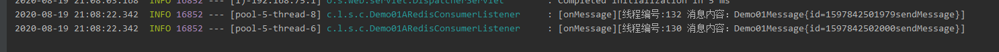
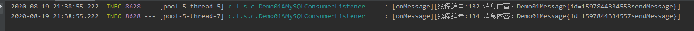
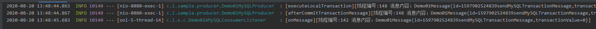

# delayMQ入门

**所有示例均记录在delayMQ-sample中**

## 1 入门示例

1. maven引入

   ~~~
   dealyMQ默认使用redis分布式锁，并且默认使用redis作为消息队列，需要引入spring-boot-redis
   <dependency>
       <groupId>org.springframework.boot</groupId>
       <artifactId>spring-boot-starter-data-redis</artifactId>
   </dependency>
   
   <dependency>
      <groupId>com.luoluocode</groupId>
      <artifactId>delayMQ</artifactId>
      <version>1.0-REALEASE</version>
   </dependency>
   ~~~

2. 添加redis配置

   ~~~
   server.port=8080
   spring.redis.host=127.0.0.1
   spring.redis.port=6379
   ~~~

3. 配置生产者

   ~~~java
   package com.luoluo.sample.producer;
   
   import com.luoluo.delaymq.common.Message;
   import com.luoluo.delaymq.producer.RedisMQProducer;
   import com.luoluo.sample.message.Demo01Message;
   import org.springframework.beans.factory.annotation.Autowired;
   import org.springframework.web.bind.annotation.GetMapping;
   import org.springframework.web.bind.annotation.RequestMapping;
   import org.springframework.web.bind.annotation.RestController;
   
   @RestController
   @RequestMapping(value = "/test")
   public class Demo01RedisProducer {
   
   	//引入Redis队列发送方式
       @Autowired
       private RedisMQProducer redisMQProducer;
   
       @GetMapping(value = "/sendRedisMessage")
       public void syncSend() {
       	// 创建 Demo01Message 消息
           Demo01Message demo01Message = new Demo01Message();
           demo01Message.setId(UUID.randomUUID().toString());
           long currentTimeMillis = System.currentTimeMillis();
           SimpleDateFormat simpleDateFormat = new SimpleDateFormat("yyyy-MM-dd HH:mm:ss");
           String format = simpleDateFormat.format(new Date(currentTimeMillis));
           System.out.println(demo01Message.getId() + format);
           //发送消息demo01Message, Topic：Test,默认立即消费
           redisMQProducer.sendMessage(demo01Message, "Test");
   
           //发送消息demo01Message, Topic：Test, 五秒后消费
           redisMQProducer.sendMessage(demo01Message, "Test", currentTimeMillis + 5000L);
   
           //发送消息demo01Message, Topic：Test, 当前消费，设置消息id
           //如果不设置 则默认使用uuid作为消息主键 请确认保证消息id唯一
           //如果消息id重复 mysql队列插入报错 redis队列会覆盖消息
           String msgId = redisMQProducer.sendMessage(demo01Message, "Test", currentTimeMillis, demo01Message.getId());
           System.out.println("唯一消息id" + msgId);
       }
}
   ~~~
   
   ~~~java
   package com.luoluo.sample.message;
   
   /**
    * 示例 01 的 Message 消息
    */
   public class Demo01Message {
   
       public static final String TOPIC = "DEMO_01";
   
       /**
        * 编号
        */
       private String id;
   
       public Demo01Message setId(String id) {
           this.id = id;
           return this;
       }
   
       public String getId() {
           return id;
       }
   }
   ~~~
   
4. 配置消费者

   ~~~java
   @Slf4j
   @Component
   @DelayMQMessageListener(
           topic = "Test"
           , consumerGroup = "demo01-C-consumer-group-" + "Topic"
   )
   public class Demo01ARedisConsumerListener extends AbstractDelayMQConsumerListener<Demo01Message> {
   
       @Autowired
       RedisUtils redisUtils;
       
       @Override
       @Transactional(rollbackFor = Throwable.class)
       public ConsumerStatus onMessage(Demo01Message message, String msgId) {
           log.info("[onMessage][线程编号:{} 消息id:{} 消息内容：{}]", Thread.currentThread().getId(), msgId, JSONUtil.toJSONString(message));
           redisUtils.incr(getClass().getName());
           return ConsumerStatus.SUCCESS;
       }
   }
   ~~~
   
5. 访问http://localhost:8080/test/sendRedisMessage

6. 效果: 

	示例中发送了两条立即执行的延时消息。
  
  > 

## 2 更多生产者发送示例

### 2.1 引入mysql发送队列

1. 执行delaymq.sql，创建所需表

2. 引入maven支持

~~~xml
  		<!-- Spring-jdbc 用于配置JdbcTemplate -->
        <!-- 引入jdbc支持 -->
        <dependency>
            <groupId>org.springframework.boot</groupId>
            <artifactId>spring-boot-starter-jdbc</artifactId>
        </dependency>

        <dependency>
            <groupId>mysql</groupId>
            <artifactId>mysql-connector-java</artifactId>
        </dependency>
~~~

3. 配置连接

~~~properties
spring.datasource.username=root
spring.datasource.password=****
spring.datasource.url=jdbc:mysql://192.168.75.128:3307/delaymq?useUnicode=yes&characterEncoding=UTF-8&autoReconnect=true&useSSL=false&driver=com.mysql.cj.jdbc.Driver
spring.datasource.driver-class-name=com.mysql.cj.jdbc.Driver
//开启mysql队列  
com.luoluo.delaymq.allow-mysql=true
~~~

4. 配置发送类

~~~java
	/**
     * 同步发送
     */
    @GetMapping(value = "/sendMySQLMessage")
    @Transactional(rollbackFor = Throwable.class)
    public void syncSend() {
        // 创建 Demo01Message 消息
        Demo01Message demo01Message = new Demo01Message();
        demo01Message.setId(UUID.randomUUID().toString());
        long currentTimeMillis = System.currentTimeMillis();
        SimpleDateFormat simpleDateFormat = new SimpleDateFormat("yyyy-MM-dd HH:mm:ss");
        String format = simpleDateFormat.format(new Date(currentTimeMillis));
        System.out.println(demo01Message.getId() + format);
        //发送消息demo01Message, Topic：Test,默认立即消费
        mySQLProducer.sendMessage(demo01Message, "Test");

        //发送消息demo01Message, Topic：Test, 五秒后消费
        mySQLProducer.sendMessage(demo01Message, "Test", currentTimeMillis + 5000L);

        //发送消息demo01Message, Topic：Test, 当前消费，设置消息id
        //如果不设置 则默认使用uuid作为消息主键 请确认保证消息id唯一
        //如果消息id重复 mysql队列插入报错 redis队列会覆盖消息
        String msgId = mySQLProducer.sendMessage(demo01Message, "Test", currentTimeMillis, demo01Message.getId());
        System.out.println("唯一消息id" + msgId);
    }
~~~

5. 配置消费者

~~~java
package com.luoluo.sample.consumer;

import com.luoluo.delaymq.constant.QueueTypeEnum;
import com.luoluo.delaymq.consumer.AbstractDelayMQConsumerListener;
import com.luoluo.delaymq.consumer.ConsumerStatus;
import com.luoluo.delaymq.consumer.annotation.DelayMQMessageListener;
import com.luoluo.sample.message.Demo01Message;
import org.slf4j.Logger;
import org.slf4j.LoggerFactory;
import org.springframework.stereotype.Component;
import org.springframework.transaction.annotation.Transactional;

@Component
@DelayMQMessageListener(
        topic = "Test"
        , consumerGroup = "demo01-A-consumer-group-" + "Topic"
    	//不同点，默认是Reids队列
        , queueType = QueueTypeEnum.MYSQL_QUEUE
)
public class Demo01AMySQLConsumerListener extends AbstractDelayMQConsumerListener<Demo01Message> {

    private Logger logger = LoggerFactory.getLogger(getClass());

  	 @Autowired
    RedisUtils redisUtils;
    
    @Override
    @Transactional(rollbackFor = Throwable.class)
    public ConsumerStatus onMessage(Demo01Message message, String msgId) {
        log.info("[onMessage][线程编号:{} 消息id:{} 消息内容：{}]", Thread.currentThread().getId(), msgId, JSONUtil.toJSONString(message));
        redisUtils.incr(getClass().getName());
        return ConsumerStatus.SUCCESS;
    }

}
~~~

6. 访问http://localhost:8080/test/sendMySQLMessage

7. 效果

   示例中发送了两条立即执行的延时消息。

   > 

### 2.2 其他发送方式

#### 2.2.1 包裹异常的同步发送和同步发送设置超时

~~~java
    //redis队列
    @GetMapping(value = "/syncSendRedisMessage")
    public void syncSend2() {
        // 创建 Demo01Message 消息
        Demo01Message demo01Message = new Demo01Message();
        demo01Message.setId(System.currentTimeMillis() + "sendMessage");
        Message<Demo01Message> message = new Message<>();
        message.setBody(demo01Message);
        message.setTopicName("Test");
        message.setExecuteTime(System.currentTimeMillis() + DateNumUtil.FIVE_SECOND);
        // 同步发送消息
        SendResultFuture sendResultFuture = redisMQProducer.syncSendMessage(message);
        System.out.println(sendResultFuture.isSuccess());

        // 同步发送消息设置超时 单位ms
        demo01Message.setId(System.currentTimeMillis() + "timeout_sendMessage");
        sendResultFuture = redisMQProducer.syncSendMessage(message, 100);
        System.out.println(sendResultFuture.isSuccess());
        if (!sendResultFuture.isSuccess()) {
            sendResultFuture.getThrowable().printStackTrace();
        }
    }
~~~

~~~java
    @GetMapping(value = "/syncSendMySQLMessage")
    public void syncSendMySQLMessage() {
        // 创建 Demo01Message 消息
        Demo01Message demo01Message = new Demo01Message();
        demo01Message.setId(System.currentTimeMillis() + "sendMessage");
        Message<Demo01Message> message = new Message<>();
        message.setBody(demo01Message);
        message.setTopicName("Test");
        message.setExecuteTime(System.currentTimeMillis() + DateNumUtil.FIVE_SECOND);
        // 同步发送消息
        SendResultFuture sendResultFuture = mySQLProducer.syncSendMessage(demo01Message, "Test", System.currentTimeMillis(), UUID.randomUUID().toString());;
        // 同步发送消息 超时0.5s
        SendResultFuture sendResultFuture1 = mySQLProducer.syncSendMessage(demo01Message, "Test", System.currentTimeMillis(), UUID.randomUUID().toString(),500);;

        System.out.println(sendResultFuture.isSuccess());
    }
~~~

#### 2.2.2 异步发送

~~~java
   	//redis
	@GetMapping(value = "/asyncSendRedisMessageFuture")
    public void asyncSendMessageFuture() {
        // 创建 Demo01Message 消息
        Demo01Message demo01Message = new Demo01Message();
        demo01Message.setId(System.currentTimeMillis() + "asyncSendMessageFuture");
        Message<Demo01Message> message = new Message<>();
        message.setBody(demo01Message);
        message.setTopicName("Test");
        message.setExecuteTime(System.currentTimeMillis() + DateNumUtil.FIVE_SECOND);
        // 异步发送消息 提供
        redisMQProducer.asyncSendMessageFuture(message);

    }

~~~

~~~java
	//mysql
	@GetMapping(value = "/asyncSendMessageFuture")
    public void asyncSendMessageFuture() {
        // 创建 Demo01Message 消息
        Demo01Message demo01Message = new Demo01Message();
        demo01Message.setId(System.currentTimeMillis() + "asyncSendMessageFuture");
        Message<Demo01Message> message = new Message<>();
        message.setBody(demo01Message);
        message.setTopicName("Test");
        message.setExecuteTime(System.currentTimeMillis() + DateNumUtil.FIVE_SECOND);
        // 异步发送消息
        mySQLProducer.asyncSendMessageFuture(message);
    }
~~~

#### 2.2.3 hashkey 发送

~~~java
 	 //mysql 版 redis类似 hashkey发送一般配合顺序消费使用
	//注意一定要符合执行时间顺序 才可保证顺序消息消费
	 @GetMapping(value = "/hashSendMySQLMessage")
    public void hashSendMessage() {
        String hashKey = "orderId";
        // 创建 Demo01Message 消息
        Demo01Message demo01Message = new Demo01Message();
        demo01Message.setId(System.currentTimeMillis() + "sendMessage1");
        //同步hash发送第一种方式 执行时间为当前 则将立即被消费
        long timestamp = System.currentTimeMillis();
        mySQLProducer.hashSendMessage(demo01Message, "Test", timestamp, hashKey);

        demo01Message = new Demo01Message();
        demo01Message.setId(System.currentTimeMillis() + "sendMessage2");
        Message<Demo01Message> message = new Message<>();
        message.setBody(demo01Message);
        message.setTopicName("Test");
        //注意一定要符合执行时间顺序 才可保证有序
        message.setExecuteTime(timestamp + 1);
        //同步发送第二种方式  构造好Message类
        mySQLProducer.hashSendMessage(message, hashKey);
    }
~~~

#### 2.2.5 异步发送回调

~~~java
 /**
     * 异步发送回调
     * 某些情况下 我们需要异步发送 并适时得到回调结果  
     * 如下示例 redis 类似
     */
    @GetMapping(value = "/asyncSendMySQLMessageCallback")
    public void asyncSendMessageCallback() {
        // 创建 Demo01Message 消息
        Demo01Message demo01Message = new Demo01Message();
        demo01Message.setId(System.currentTimeMillis() + "asyncSendMessageCallback");
        Message<Demo01Message> message = new Message<>();
        message.setBody(demo01Message);
        message.setTopicName("Test");
        message.setExecuteTime(System.currentTimeMillis());
        // 同步发送消息
        mySQLProducer.asyncSendMessageCallback(message, new SendResultCallback() {
            @Override
            public void success() {
                System.out.println("success");
            }

            @Override
            public void fail(Throwable e) {
                System.out.println("fail");
                e.printStackTrace();
            }
        });
    }
~~~

#### 2.2.4  事务发送

~~~java
 	//mysql 版 redis类似即可
	@GetMapping(value = "/sendMySQLTransactionMessage") 
    public void sendTransactionMessage() {
     // 创建 Demo01Message 消息
        int transactionValue = atomicInteger.getAndIncrement();
        Demo01Message demo01Message = new Demo01Message();
        demo01Message.setId(System.currentTimeMillis() + "sendMySQLTransactionMessage");
        demo01Message.setTransactionValue(transactionValue);
        Message<Demo01Message> message = new Message<>();
        message.setBody(demo01Message);
        message.setTopicName("Test");
        message.setExecuteTime(System.currentTimeMillis());
        // 同步发送事务消息 如果为mysql队列 并且在同一个业务库 则同步发送即可确保事务。
        mySQLProducer.sendTransactionMessage(message);
    }
~~~

 当为事务消息时 **必须**有一个处理 queueType对应topic事务 确认的bean 例如：
~~~java
 	/**
     * 确保Topic和队列类型能够对应一致，redis版类似
     */
    @DelayMQTransactionListener(topicName = "Test", queueType = QueueTypeEnum.MYSQL_QUEUE)
    public class TransactionListenerImpl  implements DelayMQLocalTransactionListener<Demo01Message> {

        /**
         * 第一次先有本地确认事务是否需要提交 
         * @param demo01Message
         * @return
         */
        @Override
        public DelayMQTransactionState executeLocalTransaction(Demo01Message demo01Message) {
            logger.info("[executeLocalTransaction][线程编号:{} 消息内容：{}]", Thread.currentThread().getId(), demo01Message);
            if (demo01Message.getTransactionValue() % 5 == 0) {
                return DelayMQTransactionState.COMMIT;
            }
            if (demo01Message.getTransactionValue() % 5 == 1) {
                return DelayMQTransactionState.ROLLBACK;
            }
            return DelayMQTransactionState.UNKNOWN;
        }

        /**
         * 回调确认是否提交
         * @param demo01Message
         * @return
         */
        @Override
        public DelayMQTransactionState checkLocalTransaction(Demo01Message demo01Message) {
            logger.info("[checkLocalTransaction][线程编号:{} 消息内容：{}]", Thread.currentThread().getId(), demo01Message);
            if (demo01Message.getTransactionValue() % 5 == 2) {
                return DelayMQTransactionState.COMMIT;
            }
            if (demo01Message.getTransactionValue() % 5 == 3) {
                return DelayMQTransactionState.ROLLBACK;
            }
            return DelayMQTransactionState.UNKNOWN;
        }

        /**
         * 扩展接口
         * 事务消息提交后的扩展（第一次本地确认 和回调确认都会触发）
         * @param demo01Message
         */
        @Override
        public void afterCommitTransactionMessage(Demo01Message demo01Message) {
            logger.info("[afterCommitTransactionMessage][线程编号:{} 消息内容：{}]", Thread.currentThread().getId(), demo01Message);

        }

        /**
         * 扩展接口
         * 事务消息提交后的扩展（第一次本地确认 回调确认触发）
         * @param demo01Message
         */
        @Override
        public void afterRollbackTransactionMessage(Demo01Message demo01Message) {
            logger.info("[afterRollbackTransactionMessage][线程编号:{} 消息内容：{}]", Thread.currentThread().getId(), demo01Message);

        }

        /**
         * 扩展接口
         * 超过次数回滚事务消息（超过重试次数触发）
         * @param demo01Message
         */
        @Override
        public void afterOverRetryTransactionMessage(Demo01Message demo01Message) {
            logger.info("[afterOverRetryTransactionMessage][线程编号:{} 消息内容：{}]", Thread.currentThread().getId(), demo01Message);
        }

        /**
         * 扩展接口
         * 事务消息待确认的扩展（异常+不确定 触发）
         * @param demo01Message
         */
        @Override
        public void afterDelayTransactionMessage(Demo01Message demo01Message) {
            logger.info("[afterDelayTransactionMessage][线程编号:{} 消息内容：{}]", Thread.currentThread().getId(), demo01Message);
        }
    }
~~~

> **上述两个确认事务消息状态接口必须提供实现，四个扩展接口则取决业务需要。** 
>
> 可继承 **AbstractDelayMQTransactionListener**，作为默认适配器提供了扩展接口的基本实现。
>
> **当为mysql队列 并且在同一个业务库 则同步发送即可确保事务。**

> 发送事务消息的必要性：
>
> 举个栗子，当对数据库进行操作时，希望只有事务提交了，消息才能 生效。
>
> 如果在事务提交前发送消息，此时服务器宕机，就有可能存在消息已发送，事务未提交。
>
> 如果在事务提交后发送消息，此时服务器宕机，就可能存在事务提交，消息未发送。
>
> 使用2-pc机制，在事务提交前发送消息，如果宕机，事务消息会在服务启动之后进行回调确认，因此事务消息发送时是一致的。（仿照了RocketMQ的思想，但是RocketMQ只保证了事务消息发送的一致性，我们将在后续继续演示消息消费的一致性。）

- 事务发送消息执行效果（服务器宕机情况请自行尝试）

  访问http://localhost:8080/test/sendMySQLTransactionMessage

  效果：

#### 2.2.5 生产者配置说明

~~~properties
//是否开启自动创建topic 默认是true
com.luoluo.delaymq.producer.auto-creat-topic=true
//自动创建topic时 topic拆分几个写队列(用来降低消费时的冲突，默认为4 可适当增大或减小 但必须大于0)
com.luoluo.delaymq.producer.write-topic-queue-num=5
//消息存活时间 仅对redis队列有效
com.luoluo.delaymq.producer.msg-survive-time=86400
~~~

#### 2.2.6 手动创建topic

不开启自动创建topic时，需要先手动创建topic队列 

~~~
1：redis设置名称为"Test",四个写队列的Topic(将下面的Test替换名称即可得到需要的Topic) 示例：
SET MESSAGE:TOPIC:TABLE:Test {\"queueNames\":[\"MESSAGE:QUEUE:Test:0\",\"MESSAGE:QUEUE:Test:1\",\"MESSAGE:QUEUE:Test:2\",\"MESSAGE:QUEUE:Test:3\",\"MESSAGE:QUEUE:Test:4\"],\"rebalanceStrategyEnum\":\"ROUND\"}

ZADD MESSAGE:QUEUE:Test:0 9223372036854776000 Message:QUEUE:Test:0
ZADD MESSAGE:QUEUE:Test:1 9223372036854776000 Message:QUEUE:Test:1
ZADD MESSAGE:QUEUE:Test:2 9223372036854776000 Message:QUEUE:Test:2
ZADD MESSAGE:QUEUE:Test:3 9223372036854776000 Message:QUEUE:Test:3

ZADD MESSAGE:QUEUE:Test:DELAY:0 9223372036854776000 Message:QUEUE:Test:DELAY:0
ZADD MESSAGE:QUEUE:Test:DELAY:1 9223372036854776000 Message:QUEUE:Test:DELAY:1
ZADD MESSAGE:QUEUE:Test:DELAY:2 9223372036854776000 Message:QUEUE:Test:DELAY:2
ZADD MESSAGE:QUEUE:Test:DELAY:3 9223372036854776000 Message:QUEUE:Test:DELAY:3
~~~

~~~sql
2：mysql设置名称为"Test",四个写队列的Topic(将下面的Test替换名称即可得到需要的Topic) 示例：
CREATE TABLE `MESSAGE:QUEUE:Test:0` (
  `id` varchar(64) NOT NULL COMMENT 'ID',
  `version` int(10) unsigned DEFAULT '0' COMMENT '版本号',
  `updated_time` datetime DEFAULT NULL COMMENT '更新时间',
  `created_time` timestamp NOT NULL DEFAULT CURRENT_TIMESTAMP COMMENT '操作时间',
  `score` bigint(13) DEFAULT NULL COMMENT '分数',
  PRIMARY KEY (`id`),
  KEY `index_score` (`score`)
) ENGINE=InnoDB DEFAULT CHARSET=utf8mb4 COMMENT='Message:QUEUE:Test:0顺序表';
CREATE TABLE `MESSAGE:QUEUE:Test:1` (
  `id` varchar(64) NOT NULL COMMENT 'ID',
  `version` int(10) unsigned DEFAULT '0' COMMENT '版本号',
  `updated_time` datetime DEFAULT NULL COMMENT '更新时间',
  `created_time` timestamp NOT NULL DEFAULT CURRENT_TIMESTAMP COMMENT '操作时间',
  `score` bigint(13) DEFAULT NULL COMMENT '分数',
  PRIMARY KEY (`id`),
  KEY `index_score` (`score`)
) ENGINE=InnoDB DEFAULT CHARSET=utf8mb4 COMMENT='Message:QUEUE:Test:1顺序表';
CREATE TABLE `MESSAGE:QUEUE:Test:2` (
  `id` varchar(64) NOT NULL COMMENT 'ID',
  `version` int(10) unsigned DEFAULT '0' COMMENT '版本号',
  `updated_time` datetime DEFAULT NULL COMMENT '更新时间',
  `created_time` timestamp NOT NULL DEFAULT CURRENT_TIMESTAMP COMMENT '操作时间',
  `score` bigint(13) DEFAULT NULL COMMENT '分数',
  PRIMARY KEY (`id`),
  KEY `index_score` (`score`)
) ENGINE=InnoDB DEFAULT CHARSET=utf8mb4 COMMENT='Message:QUEUE:Test:2顺序表';
CREATE TABLE `MESSAGE:QUEUE:Test:3` (
  `id` varchar(64) NOT NULL COMMENT 'ID',
  `version` int(10) unsigned DEFAULT '0' COMMENT '版本号',
  `updated_time` datetime DEFAULT NULL COMMENT '更新时间',
  `created_time` timestamp NOT NULL DEFAULT CURRENT_TIMESTAMP COMMENT '操作时间',
  `score` bigint(13) DEFAULT NULL COMMENT '分数',
  PRIMARY KEY (`id`),
  KEY `index_score` (`score`)
) ENGINE=InnoDB DEFAULT CHARSET=utf8mb4 COMMENT='Message:QUEUE:Test:3顺序表';

CREATE TABLE `MESSAGE:QUEUE:Test:DELAY:0` (
  `id` varchar(64) NOT NULL COMMENT 'ID',
  `version` int(10) unsigned DEFAULT '0' COMMENT '版本号',
  `updated_time` datetime DEFAULT NULL COMMENT '更新时间',
  `created_time` timestamp NOT NULL DEFAULT CURRENT_TIMESTAMP COMMENT '操作时间',
  `score` bigint(13) DEFAULT NULL COMMENT '分数',
  PRIMARY KEY (`id`),
  KEY `index_score` (`score`)
) ENGINE=InnoDB DEFAULT CHARSET=utf8mb4 COMMENT='Message:QUEUE:Test:DELAY:0顺序表';
CREATE TABLE `MESSAGE:QUEUE:Test:DELAY:1` (
  `id` varchar(64) NOT NULL COMMENT 'ID',
  `version` int(10) unsigned DEFAULT '0' COMMENT '版本号',
  `updated_time` datetime DEFAULT NULL COMMENT '更新时间',
  `created_time` timestamp NOT NULL DEFAULT CURRENT_TIMESTAMP COMMENT '操作时间',
  `score` bigint(13) DEFAULT NULL COMMENT '分数',
  PRIMARY KEY (`id`),
  KEY `index_score` (`score`)
) ENGINE=InnoDB DEFAULT CHARSET=utf8mb4 COMMENT='Message:QUEUE:Test:DELAY:1顺序表';
CREATE TABLE `MESSAGE:QUEUE:Test:DELAY:2` (
  `id` varchar(64) NOT NULL COMMENT 'ID',
  `version` int(10) unsigned DEFAULT '0' COMMENT '版本号',
  `updated_time` datetime DEFAULT NULL COMMENT '更新时间',
  `created_time` timestamp NOT NULL DEFAULT CURRENT_TIMESTAMP COMMENT '操作时间',
  `score` bigint(13) DEFAULT NULL COMMENT '分数',
  PRIMARY KEY (`id`),
  KEY `index_score` (`score`)
) ENGINE=InnoDB DEFAULT CHARSET=utf8mb4 COMMENT='Message:QUEUE:Test:DELAY:2顺序表';
CREATE TABLE `MESSAGE:QUEUE:Test:DELAY:3` (
  `id` varchar(64) NOT NULL COMMENT 'ID',
  `version` int(10) unsigned DEFAULT '0' COMMENT '版本号',
  `updated_time` datetime DEFAULT NULL COMMENT '更新时间',
  `created_time` timestamp NOT NULL DEFAULT CURRENT_TIMESTAMP COMMENT '操作时间',
  `score` bigint(13) DEFAULT NULL COMMENT '分数',
  PRIMARY KEY (`id`),
  KEY `index_score` (`score`)
) ENGINE=InnoDB DEFAULT CHARSET=utf8mb4 COMMENT='Message:QUEUE:Test:DELAY:3顺序表';

INSERT INTO `delaymq`.`topic_table`(`id`, `version`, `updated_time`, `created_time`, `topic_data`) VALUES ('Test', 0, NULL, '2020-08-19 13:32:58', '{\"queueNames\": [\"Message:QUEUE:Test:0\", \"Message:QUEUE:Test:1\", \"Message:QUEUE:Test:2\", \"Message:QUEUE:Test:3\"], \"rebalanceStrategyEnum\": \"ROUND\"}');
~~~

## 3 消费者配置示例

### 3.1 消费者配置说明

> 消费者配置分为 配置文件配置和注解配置
>
> 配置文件配置：管控全局
> 注解配置：特性配置（会覆盖配置文件配置）

~~~properties
//开启mysql队列  
com.luoluo.delaymq.allow-mysql=true

//监听类型 可用注解覆盖 默认Reids队列
com.luoluo.delaymq.consumer.queue-type=redis_queue

//服务启动往回消费的topic的时间 单位s 
//配置-2为从最初开始消费，配置0为从当前开始消费，
//默认配置-1，从上次消费的最末，继续消费
//可用注解覆盖 
com.luoluo.delaymq.consumer.reverse-time=30

//消息回溯时间 默认15s
//消费端会记录消费位点 如果此时生产者发送卡顿,导致了某些消息发送到消费位点前 
//配置此项可以解决消息生产乱序后 有的消息无法消费的问题 
//可用注解覆盖配置
com.luoluo.delaymq.consumer.back-track-time=15

//消费者管理模式 为统一管理merge 和 各自管理part
//统一管理由同一个线程池共同调度所有的线程
//各自管理，每个消费者都有自身的线程池负责调度
//默认为统一管理
//可用注解覆盖配置
com.luoluo.delaymq.consumer.consume-group-type=merge

//当为part各自管理时 配置各自线程池的最小线程和最大线程数
//默认为4
//可用注解覆盖配置
com.luoluo.delaymq.consumer.consume-thread=4
com.luoluo.delaymq.consumer.consume-thread-max=4

//当为part各自管理时 配置统一管理调度的线程池大小(fixed线程池) 
//默认为16
//可用注解覆盖配置
com.luoluo.delaymq.consumer.merge-consume-thread=16

//一次从存储端拉取的消息数 
//默认最大2000条
//可用注解覆盖配置
com.luoluo.delaymq.consumer.pull-message-size=2000

//消费失败后消费重试次数
//默认重试8次
//可用注解覆盖配置
com.luoluo.delaymq.consumer.retry-count=8

//消费失败后下次重试间隔时间
//默认15s
//可用注解覆盖配置
com.luoluo.delaymq.consumer.retry-delay-time=15

//是否支持事务消费
//默认不支持
//可用注解覆盖配置
//支持需要 1：使用mysql作为队列存储 2：消息表和业务表同库 3：支持jdbcTemplae和mybatis 不支持jpa
com.luoluo.delaymq.consumer.support-transaction=false

//仿照rocketmq 配置文件中支持排除指定的consumer-group对topic消费 true:消费 fale:不消费
com.luoluo.delaymq.consumer.listeners.demo01-A-consumer-group-Topic.Test: true
~~~

注解配置

~~~properties
大部分和配置文件相同 除以下

consumeMode 消费模式 默认顺序消费
----CONCURRENTLY 消费者并发消费
----ORDERLY 消费者顺序消费
~~~

### 3.2 示例

#### 3.2.1 引入mysql消费队列

~~~java
@Component
@DelayMQMessageListener(
    	//必须配置监听topic
        topic = "Test"
    	//必须配置消费者组
        , consumerGroup = "demo01-A-consumer-group-" + "Topic"
    	//默认是Reids队列，更改为MYSQL_QUEUE即可
        , queueType = QueueTypeEnum.MYSQL_QUEUE
)
public class Demo01AMySQLConsumerListener extends AbstractDelayMQConsumerListener<Demo01Message> {

    private Logger logger = LoggerFactory.getLogger(getClass());

    @Override
    @Transactional(rollbackFor = Throwable.class)
    public ConsumerStatus onMessage(Demo01Message message,String msgId) {
        logger.info("[onMessage][线程编号:{} 消息内容：{}]", Thread.currentThread().getId(), message);
        return ConsumerStatus.SUCCESS;
    }
}
~~~

#### 3.2.2 顺序消费与并发消费

~~~java
@DelayMQMessageListener(
        //必须配置监听topic
        topic = "Test"
        //必须配置消费者组
        , consumerGroup = "demo01-A-consumer-group-" + "Topic"
        //默认是Reids队列，更改为MYSQL_QUEUE即可
        , queueType = QueueTypeEnum.MYSQL_QUEUE
        //默认是并行消费，改为顺序消费即可
        , consumeMode = ConsumeMode.ORDERLY
)
~~~

#### 3.2.3 注解配置

同**3.1消费者配置说明**

##4 复杂配置

当希望业务和消息不耦合时，利用spring的mysql，redis多数据源配置可以松耦合。示例在项目中

~~~
 <module>delayMQ-mybatis-mutiple</module>
 <module>delayMQ-mutiple-redis</module>
~~~

